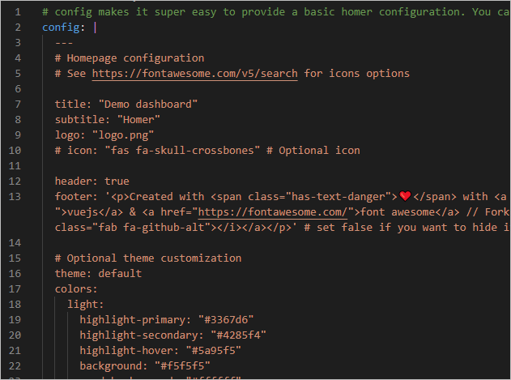
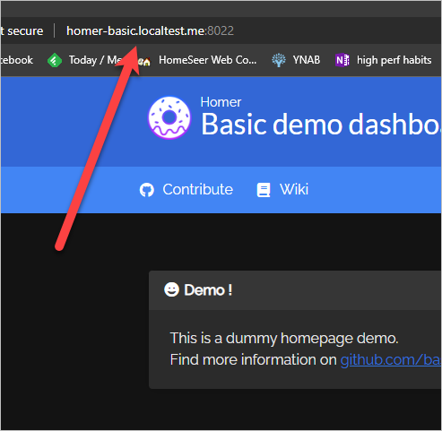
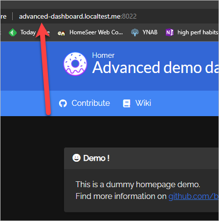

## Introduction

The main reason I created this homer helm chart is because the k8s-at-home version of the helm chart was removed when [k8s-at-home shut down](https://github.com/k8s-at-home/charts/issues/1761). There are a few other homer helm charts on artifact hub, but they either don’t work, or they’re trying their best to make k8s-at-home chart work again. I don’t want my chart to rely on the k8s-at-home common.yaml file. I want my homer helm chart to not have any external dependencies, and I want it to be based on a `helm create homer` starting point.

## Latest Release


  

{{ latest.description }}
=== "Command line"

    ``` bash title="Add the alexdresko helm repository" linenums="1"
    helm repo add alexdresko https://alexdresko.github.io/helm-charts/
    ```

    ``` bash title="Install the helm chart" linenums="1"
    helm install my-{{ latest.name }} alexdresko/{{ latest.name }} --version {{ latest.version }}

    // OR....

    helm update --install my-{{ latest.name }} alexdresko/{{ latest.name }} --version {{ latest.version }}
    ```

=== "As a sub chart"

    Add this to your `chart.yaml`

    ``` yaml
    dependencies:
      - name: {{ latest.name }}
        version: {{ latest.version }}
        repository: https://alexdresko.github.io/helm-charts/
        # For more information: https://alexdresko.github.io/helm-charts/
    ```

You can also download `{{ latest.name }}-{{ latest.version }}.tgz` directly using [this link]({{ latest.name }}-{{ latest.version }}.tgz).

## Useful links

* [bastienwirtz/homer: A very simple static homepage for your server.](https://github.com/bastienwirtz/homer)

    This is the GitHub repository for Homer and the docker image that runs it

* [b4bz/homer - Docker Image | Docker Hub](https://hub.docker.com/r/b4bz/homer)

    Here's the Docker image on the Docker Hub

* [This Homer chart on Artifac HUB](https://artifacthub.io/packages/helm/alexdresko/homer)

## Features

* **Based on [`helm create homer`](https://helm.sh/docs/helm/helm_create)** - I think all charts should begin with `helm create <chart name>`. I like it when a helm chart feels familiar and I can rely on my existing knowledge gained from charts that have a similar values structure.
* **Proof that it works** - This helm chart was written inside a [VS Code Dev Container](https://code.visualstudio.com/docs/devcontainers/containers) that hosts a k8s cluster. The [package.json](https://github.com/alexdresko/helm-charts/blob/main/package.json) file includes a number of scripts for manipulating various demos of the helm chart. Once inside the dev container, you can easily experiment with the chart and quickly see the results. This is how I know that the chart actually works, and it's a great way to let others play with the chart before implementing it in their own cluster. 

For additional features, see the [Configuration](#configuration) section.

## Configuration

This chart started by running [`helm create homer`](https://helm.sh/docs/helm/helm_create), so all of the standard features are available (although I have not tested all of them). **Below is a list of the custom features I've added.** For a complete list of supported values, see the [values.yaml file](https://github.com/alexdresko/helm-charts/blob/main/charts/homer/values.yaml).

* `.Values.config` makes it super easy to provide a basic homer configuration. You can simply put your configuration here, and it will "just work".

    

* `.Values.ingress.auto` allows for automatically creating a useful ingress resource that looks like <release name>-<chart name OR friendlyName>.localtest.me. For example, advanced-dashboard.localtest.me, where "advanced" is the helm release name, "dashboard" is specified as the friendlyName, and localtest.me is the domain.

    

* `.Values.ingress.auto.enabled` (default: false) enables or disables the auto ingress feature
* `.Values.ingress.auto.domain` (default: "localtest.me") specifies the domain to use. By default, "localtest.me" is used to make accessing the service easier locally. <anything>.localtest.me will resolve to 127.0.01. This does require an internet connection, but it only uses the internet to resolve the hostname to 127.0.0.1. It does not transmit data over the internet.
* `.Values.ingress.auto.friendlyName` (default: "homer") optionally overrides the value returned from the fullname helper. This only affects the URL that is generated, which is why I didn't use fullnameOverride or nameOverride. The [advanced demo](https://github.com/alexdresko/helm-charts/blob/main/charts/advanced.yaml) sets `friendlyName` to "dashboard", and you can see the result below:

    

* `.Values.customConfigMap.enabled` prevents `.Values.config` from being used, and allows you to create your own, more dynamic configMap. `true`, tells the the chart to look for a configmap with a name that is based on the result of `{ { .Release.Name }}-homer-custom`. When you install homer, the NOTES.txt file will spit output the very specific name that the chart is looking for. You can also look at the advanced demo for an example of how to use this feature. The [advanced demo](https://github.com/alexdresko/helm-charts/blob/main/charts/alextesto/templates/configmap.yaml) includes an example configMap.

## Previous releases

Here are the 5 most recent releases:


| Chart                     | Description                          | Current App Version     | Current Chart Version     |
| ------------------------- | ------------------------------------ | ----------------------- | ------------------------- |


| [{{ latest.name }}]({{ latest.name }}-{{ latest.version }}.tgz)      | {{ entry.description }}  | {{ entry.appVersion }} | {{ entry.version }}  |

